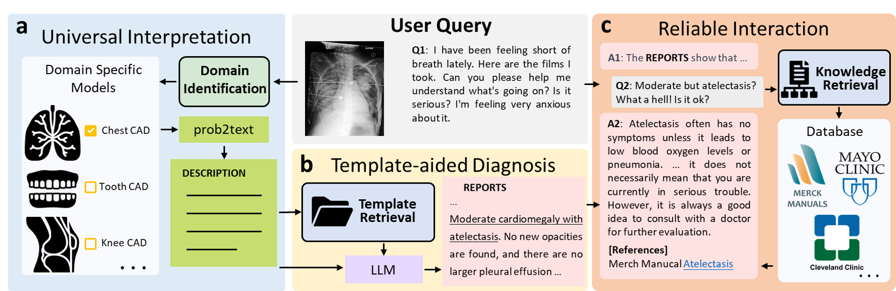
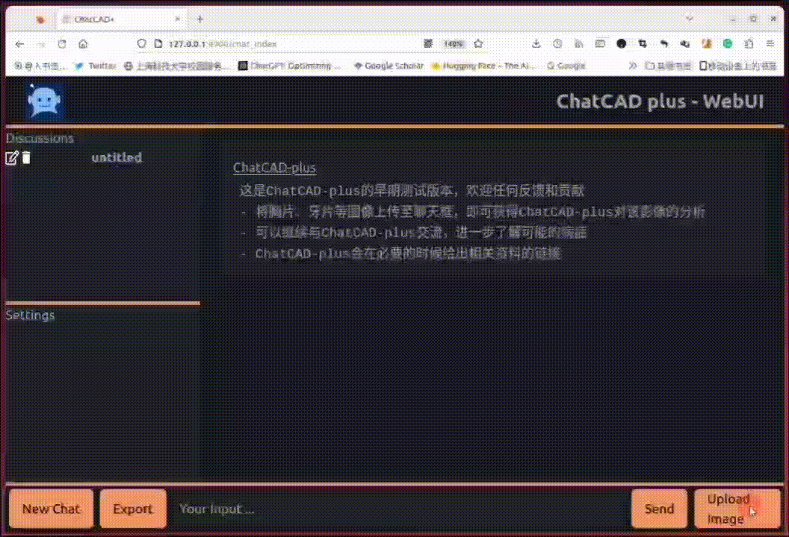
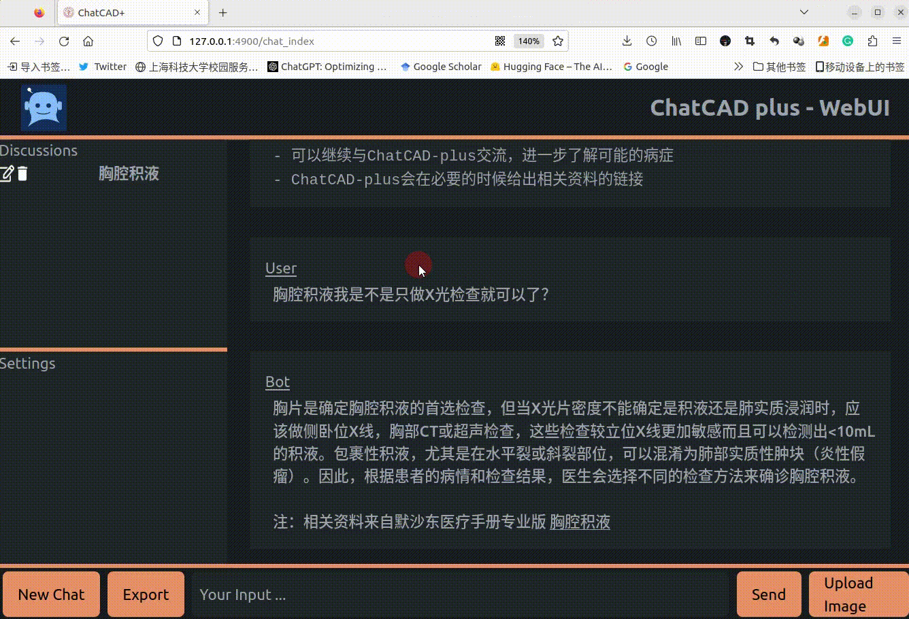

# [ChatCAD+: Towards a Reliable and Universal Interactive CAD using LLMs](https://arxiv.org/abs/2302.07257)

by Zihao Zhao\*, Sheng Wang\*, Jinchen Gu*,
Yitao Zhu*, Lanzhuju Mei,
Zixu Zhuang, Zhiming Cui, Qian Wang, Dinggang Shen<br/>

[](https://arxiv.org/abs/2302.07257)

<!--  -->

<div align="center">
  
</div>

## Introduction

This repository provides the official implementation of some components of ChatCAD+:<br/>

- Modality identification <a src="https://colab.research.google.com/assets/colab-badge.svg" href="https://colab.research.google.com/drive/1mbBgkoyk4n_qAJasY5_cOAqg7I5WP1H7?usp=sharing">
  
  </a>
- Chinese version Interactive CAD of Chest X-rays
- LLM-based knowledge retrieval
- An easy-deploy local web ui (modified from [Gpt4All Web UI](https://github.com/ParisNeo/Gpt4All-webui.git) )

<!-- **[ChatCAD: Interactive Computer-Aided Diagnosis on Medical Image using Large Language Models](https://arxiv.org/abs/2302.07257)** <br/> -->

<!-- ## 最近更新

- (2023.4.18): P-Tuning & 多轮对话 & 模型可靠性提升 -->

## Resources
- We would like to thank Merck Manual Professional who make all these medical knowledge public, we sorted their website for easier usage: [here](https://github.com/zhaozh10/ChatCAD/tree/main/engine_LLM/dataset)
- A BART-based model that has the capability to translate chest X-ray reportsinto Chinese well [[link]](https://huggingface.co/zhaozh/radiology-report-en-zh-ft-base)

## Usage

### weights&others

- MIMIC-CXR dataset: contained in annotation.json
- R2Gen weights: r2gcmn_mimic-cxr.pth
- PCAM weights: JFchexpert.pth
- Place annotation.json under ./r2g/ and pre-trained weights under ./weights/

You can either find them from original repository or dowload from [Google Drive](https://drive.google.com/drive/folders/1l78ZbQ-9waZjz49BBtdKCDxxtznd2EoY?usp=sharing)

### Deploy local web ui

- pip install -r requirements.txt
- implement web_app.py and input your openai api-key
<p align="center">
  
  <br/>
</p>
- Would like some diagnostic results? upload image --> send --> wait for your report
<p align="center">
   
   <br/>
 </p>
- ChatCAD+ will answer your question with a reference from Merck Manucal Professional
<p align="center">
   
   <br/>
 </p>

## 即将到来的更新

- [ ]  Online demo with available dental and Knee MRI network

## Citation

```
@article{wang2023chatcad,
  title={Chatcad: Interactive computer-aided diagnosis on medical image using large language models},
  author={Wang, Sheng and Zhao, Zihao and Ouyang, Xi and Wang, Qian and Shen, Dinggang},
  journal={arXiv preprint arXiv:2302.07257},
  year={2023}
}

```

## Acknowledgment

Our implementation (including coming version) is based on the following codebases. We gratefully thank the authors for their wonderful works.

[R2GenCMN](https://github.com/zhjohnchan/R2GenCMN), [PCAM](https://github.com/jfhealthcare/Chexpert), [CSNet](https://github.com/zixuzhuang/CSNet), [Gpt4All Web UI](https://github.com/ParisNeo/Gpt4All-webui.git).
