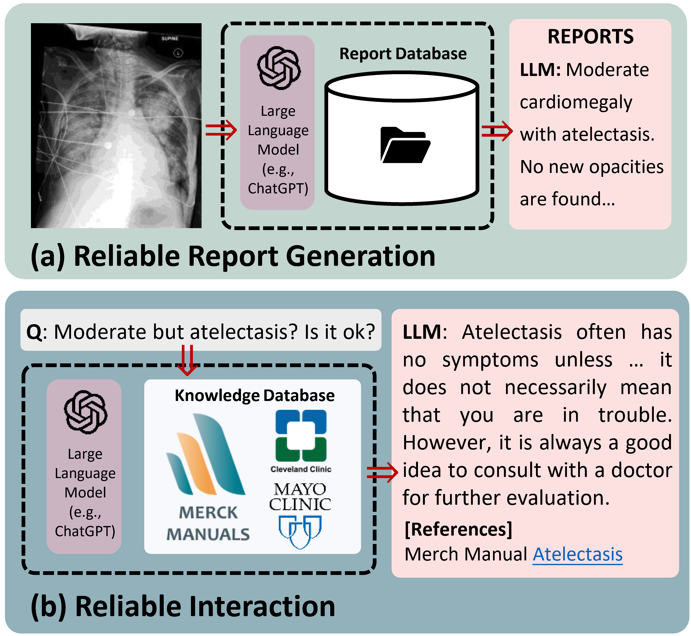
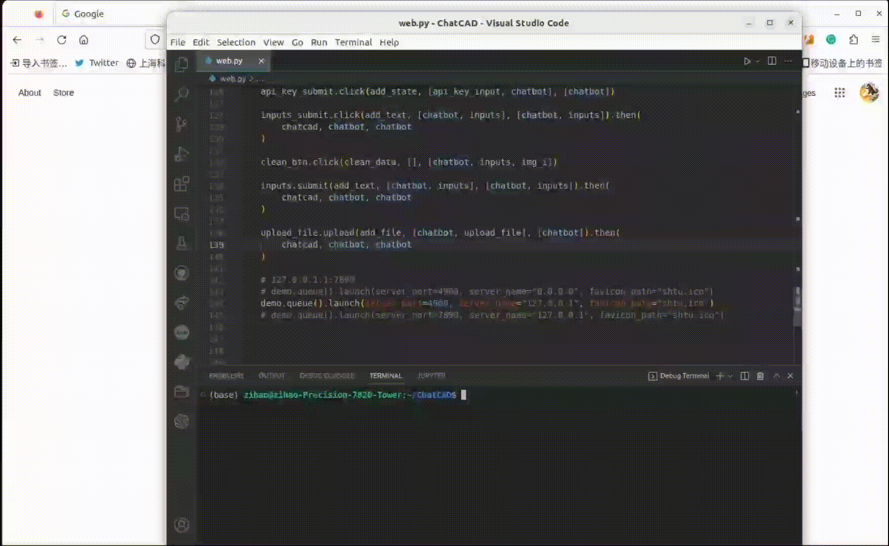

# [COMMSENG'24, TMI'24] Interactive Computer-Aided Diagnosis using LLMs

This repo includes official implementations of ChatCAD and ChatCAD+

<!-- # [IEEE TMI] ChatCAD+: Towards a Reliable and Universal Interactive CAD using LLMs
<!-- (https://arxiv.org/abs/2305.15964) -->
<!-- by Zihao Zhao\*, Sheng Wang\*, Jinchen Gu*, Yitao Zhu*, Lanzhuju Mei, Zixu Zhuang, Zhiming Cui, Qian Wang, Dinggang Shen<br/> -->

## Paper

<b>[Nature COMMSENG] ChatCAD: Interactive Computer-Aided Diagnosis on Medical Image using Large Language Models</b>
by Sheng Wang, Zihao Zhao, Xi Ouyang, Tianming Liu, Qian Wang, Dinggang Shen

<div align="center">
  
</div>

> <p align="justify"> 
> (a) Overview of our proposed strategy. The image is processed by various networks to generate diverse outputs, which are then transformed into text descriptions. The descriptions, served as a link between visual and linguistic information, are combined as inputs to a large language model (LLM). With its ability to reason and its knowledge of the medical field, the LLM can provide a condensed report. (b) Interactive explanations and medical advice from ChatCAD.

</p>

<b>[IEEE TMI] ChatCAD+: Towards a Reliable and Universal Interactive CAD using LLMs</b>
by Zihao Zhao\*, Sheng Wang\*, Jinchen Gu*, Yitao Zhu*, Lanzhuju Mei, Zixu Zhuang, Zhiming Cui, Qian Wang, Dinggang Shen

<div align="center">
  
</div>

> <p align="justify"> 
> Overview of our proposed ChatCAD+ system. (a) For patients seeking a diagnosis, ChatCAD+ generates reliable medical reports based on the input medical image(s) by referring to local report database. (b) Additionally, for any inquiry from patients, ChatCAD+ retrieves related knowledge from online database and lets large language model generate reliable response.

</p>

## Introduction

This repository provides the official implementation of some components of ChatCAD+:<br/>

- Modality identification <a src="https://colab.research.google.com/assets/colab-badge.svg" href="https://colab.research.google.com/drive/1mbBgkoyk4n_qAJasY5_cOAqg7I5WP1H7?usp=sharing">
  
  </a>
- Chinese version Interactive CAD of Chest X-rays
- LLM-based knowledge retrieval
- An easy-deploy local web ui based on Gradio

<!-- **[ChatCAD: Interactive Computer-Aided Diagnosis on Medical Image using Large Language Models](https://arxiv.org/abs/2302.07257)** <br/> -->

<!-- ## 最近更新

- (2023.4.18): P-Tuning & 多轮对话 & 模型可靠性提升 -->

## Resources

- We would like to thank Merck Manual Professional who make all these medical knowledge public, we sorted their website for easier usage: [here](https://github.com/zhaozh10/ChatCAD/tree/main/engine_LLM/dataset)
- A BART-based model that has the capability to translate chest X-ray reports into Chinese well [[link]](https://huggingface.co/zhaozh/radiology-report-en-zh-ft-base)

## Usage

### weights&others

- R2GenCMN: r2gcmn_mimic-cxr.pth and annotation.json
- PCAM weights: JFchexpert.pth
- Place annotation.json under ./r2g/ and pre-trained weights under ./weights/
- For template retrieval system, please download MIMIC-CXR reports from official [website](https://physionet.org/content/mimic-cxr/2.0.0/) and organize them into a dictionary, save as report_en_dict.json under the ./

You can either find them from original repository or dowload from [Google Drive](https://drive.google.com/drive/folders/1l78ZbQ-9waZjz49BBtdKCDxxtznd2EoY?usp=sharing)

### Deploy local web ui

- pip install -r requirements.txt
- implement web.py and load your openai api-key
<p align="center">
  
  <br/>
</p>
- Would like some diagnostic results? upload image via left panel --> wait for your report
<p align="center">
   
   <br/>
 </p>
- ChatCAD+ will answer your question with a reference from Merck Manucal Professional
<p align="center">
   
   <br/>
 </p>

<!-- ## 即将到来的更新

- [x]  Migrate the project to Gradio
- [ ]  Online demo with available dental and Knee MRI network -->

## Citation

If you find our work useful, please consider giving a star ⭐ and citation.

```
@article{wang2023chatcad,
  title={Chatcad: Interactive computer-aided diagnosis on medical image using large language models},
  author={Wang, Sheng and Zhao, Zihao and Ouyang, Xi and Wang, Qian and Shen, Dinggang},
  journal={arXiv preprint arXiv:2302.07257},
  year={2023}
}

@article{zhao2023chatcad,
      title={ChatCAD+: Towards a Universal and Reliable Interactive CAD using LLMs},
      author={Zihao Zhao and Sheng Wang and Jinchen Gu and Yitao Zhu and Lanzhuju Mei and Zixu Zhuang and Zhiming Cui and Qian Wang and Dinggang Shen},
      journal={arXiv preprint arXiv:2305.15964},
      year={2023},
}

```

## Acknowledgment

Our implementation (including coming version) is based on the following codebases. We gratefully thank the authors for their wonderful works.

[R2GenCMN](https://github.com/zhjohnchan/R2GenCMN), [PCAM](https://github.com/jfhealthcare/Chexpert), [CSNet](https://github.com/zixuzhuang/CSNet).
